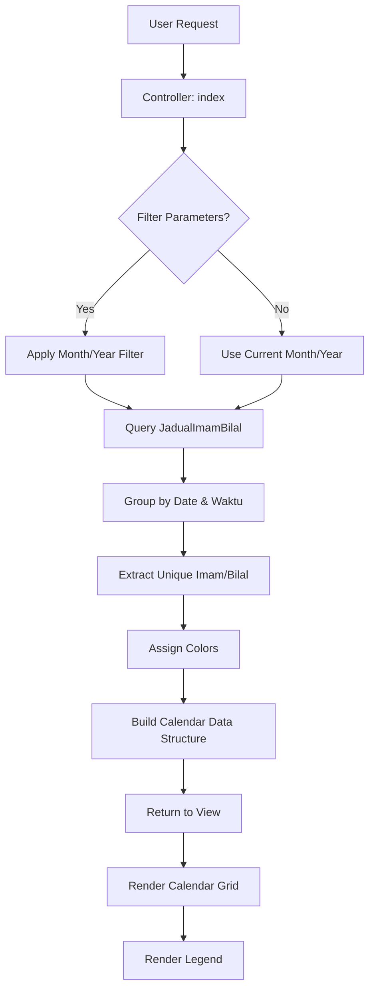

# Design Document: Jadual Imam & Bilal Calendar View

## Overview

Penambahbaikan paparan Jadual Imam & Bilal daripada format jadual biasa kepada format kalendar bulanan. Format baru akan memaparkan jadual dalam grid dengan tarikh sebagai row header dan waktu solat sebagai column header, dilengkapi dengan legend untuk menunjukkan nama imam dan bilal dengan warna kod.

## Architecture

### Component Structure

```
┌─────────────────────────────────────────────────────────────────┐
│                    Calendar View Page                            │
├─────────────────────────────────────────────────────────────────┤
│  ┌─────────────────────────────────────────────────────────┐   │
│  │                    Header Section                        │   │
│  │  - Title: Jadual Imam & Bilal                           │   │
│  │  - Month/Year Filter                                     │   │
│  │  - Action Buttons (Print, Auto-Generate, Tambah)        │   │
│  └─────────────────────────────────────────────────────────┘   │
│                                                                  │
│  ┌─────────────────────────────────────────────────────────┐   │
│  │                    Legend Section                        │   │
│  │  ┌─────────────────┐  ┌─────────────────┐              │   │
│  │  │ Imam Legend     │  │ Bilal Legend    │              │   │
│  │  │ ● Ustaz A       │  │ ○ En. X         │              │   │
│  │  │ ● Ustaz B       │  │ ○ En. Y         │              │   │
│  │  │ ● Ustaz C       │  │ ○ En. Z         │              │   │
│  │  └─────────────────┘  └─────────────────┘              │   │
│  └─────────────────────────────────────────────────────────┘   │
│                                                                  │
│  ┌─────────────────────────────────────────────────────────┐   │
│  │                 Calendar Grid                            │   │
│  │  ┌──────┬────────┬────────┬────────┬────────┬────────┐ │   │
│  │  │Tarikh│ Subuh  │ Zohor  │  Asar  │Maghrib │ Isyak  │ │   │
│  │  ├──────┼────────┼────────┼────────┼────────┼────────┤ │   │
│  │  │  1   │ A / X  │ B / Y  │ A / X  │ B / Y  │ A / X  │ │   │
│  │  │  2   │ B / Y  │ A / X  │ B / Y  │ A / X  │ B / Y  │ │   │
│  │  │ ...  │  ...   │  ...   │  ...   │  ...   │  ...   │ │   │
│  │  │  31  │ A / X  │ B / Y  │ A / X  │ B / Y  │ A / X  │ │   │
│  │  └──────┴────────┴────────┴────────┴────────┴────────┘ │   │
│  └─────────────────────────────────────────────────────────┘   │
│                                                                  │
│  ┌─────────────────────────────────────────────────────────┐   │
│  │                 Status Legend                            │   │
│  │  ✓ Selesai  ○ Dijadual  ✗ Batal  ↻ Ganti               │   │
│  └─────────────────────────────────────────────────────────┘   │
└─────────────────────────────────────────────────────────────────┘
```

### Data Flow



## Components and Interfaces

### Controller Changes

**JadualImamBilalController::index()**
- Modify to return calendar-formatted data
- Group schedules by date and waktu_solat
- Extract unique imam and bilal names for legend
- Calculate days in selected month

```php
// New data structure for view
$calendarData = [
    'month' => $month,
    'year' => $year,
    'daysInMonth' => $daysInMonth,
    'waktuSolat' => ['Subuh', 'Zohor', 'Asar', 'Maghrib', 'Isyak', 'Jumaat'],
    'schedules' => [
        // Indexed by date => waktu => schedule
        1 => [
            'Subuh' => ['imam' => 'Ustaz A', 'bilal' => 'En. X', 'status_imam' => 'Selesai', ...],
            'Zohor' => [...],
            ...
        ],
        2 => [...],
        ...
    ],
    'legend' => [
        'imam' => [
            'Ustaz A' => '#3B82F6', // blue
            'Ustaz B' => '#10B981', // green
            ...
        ],
        'bilal' => [
            'En. X' => '#F59E0B', // amber
            'En. Y' => '#8B5CF6', // purple
            ...
        ]
    ]
];
```

### View Components

**index.blade.php** - Main calendar view
- Calendar grid with responsive design
- Legend section for imam and bilal
- Filter controls for month/year
- Status indicators

**Components:**
- `x-calendar-grid` - Reusable calendar grid component
- `x-calendar-legend` - Legend display component
- `x-calendar-cell` - Individual cell with imam/bilal info

## Data Models

No changes to existing JadualImamBilal model. Data transformation happens in controller.

### Calendar Data Transformation

```php
// Helper method to transform flat data to calendar structure
private function transformToCalendarData($jadualList, $month, $year)
{
    $daysInMonth = Carbon::createFromDate($year, $month, 1)->daysInMonth;
    $schedules = [];
    $imamNames = [];
    $bilalNames = [];
    
    // Initialize empty structure
    for ($day = 1; $day <= $daysInMonth; $day++) {
        $schedules[$day] = [];
    }
    
    // Populate with actual data
    foreach ($jadualList as $jadual) {
        $day = $jadual->tarikh->day;
        $waktu = $jadual->waktu_solat;
        
        $schedules[$day][$waktu] = [
            'id' => $jadual->id,
            'imam' => $jadual->imam_display,
            'bilal' => $jadual->bilal_display,
            'status_imam' => $jadual->status_imam,
            'status_bilal' => $jadual->status_bilal,
            'imam_ganti' => $jadual->imam_ganti,
            'bilal_ganti' => $jadual->bilal_ganti,
        ];
        
        // Collect unique names
        if ($jadual->imam_display && $jadual->imam_display !== '-') {
            $imamNames[$jadual->imam_display] = true;
        }
        if ($jadual->bilal_display && $jadual->bilal_display !== '-') {
            $bilalNames[$jadual->bilal_display] = true;
        }
    }
    
    return [
        'schedules' => $schedules,
        'imamNames' => array_keys($imamNames),
        'bilalNames' => array_keys($bilalNames),
    ];
}
```

### Color Assignment

```php
// Predefined color palette for legend
private $colorPalette = [
    '#3B82F6', // blue
    '#10B981', // green
    '#F59E0B', // amber
    '#8B5CF6', // purple
    '#EF4444', // red
    '#06B6D4', // cyan
    '#EC4899', // pink
    '#84CC16', // lime
    '#F97316', // orange
    '#6366F1', // indigo
];

private function assignColors($names)
{
    $colors = [];
    foreach ($names as $index => $name) {
        $colors[$name] = $this->colorPalette[$index % count($this->colorPalette)];
    }
    return $colors;
}
```

## Correctness Properties

*A property is a characteristic or behavior that should hold true across all valid executions of a system-essentially, a formal statement about what the system should do. Properties serve as the bridge between human-readable specifications and machine-verifiable correctness guarantees.*

### Property 1: Calendar rows match days in month
*For any* selected month and year, the calendar grid SHALL display exactly the number of date rows equal to the days in that month (28-31 days).
**Validates: Requirements 1.1, 3.4**

### Property 2: Friday column visibility
*For any* date in the calendar, the Jumaat column SHALL be active/visible if and only if that date falls on a Friday.
**Validates: Requirements 1.3, 1.4**

### Property 3: Schedule data placement
*For any* schedule record in the database, it SHALL appear in the calendar cell corresponding to its tarikh (date) and waktu_solat.
**Validates: Requirements 1.5**

### Property 4: Legend completeness
*For any* calendar view, the legend SHALL contain all unique imam and bilal names that appear in the displayed schedules.
**Validates: Requirements 2.1, 2.2**

### Property 5: Color consistency
*For any* imam or bilal name, the color used in the calendar cells SHALL match the color assigned in the legend.
**Validates: Requirements 2.3, 2.4**

### Property 6: Filter functionality
*For any* month and year filter selection, the calendar SHALL display only schedules where the tarikh falls within that month and year.
**Validates: Requirements 3.1, 3.2**

### Property 7: Status-based styling
*For any* schedule record, the visual indicator SHALL correspond to its status: green for "Selesai", default for "Dijadual", red for "Batal", orange with replacement name for "Ganti".
**Validates: Requirements 5.1, 5.2, 5.3, 5.4, 2.5**

## Error Handling

1. **Empty Month**: If no schedules exist for selected month, display empty calendar grid with message
2. **Invalid Date**: If invalid month/year provided, default to current month/year
3. **Missing Imam/Bilal**: Display "-" in cell if no imam or bilal assigned
4. **Color Overflow**: If more than 10 unique names, cycle through color palette

## Testing Strategy

### Unit Tests
- Test `transformToCalendarData()` method with various inputs
- Test `assignColors()` method for color assignment
- Test date calculations for different months (28, 29, 30, 31 days)

### Property-Based Tests
Using PHPUnit with data providers for property-based testing approach:

1. **Property 1 Test**: Generate random month/year combinations, verify row count matches days in month
2. **Property 2 Test**: Generate dates, verify Friday detection and column visibility
3. **Property 3 Test**: Generate schedule records, verify correct cell placement
4. **Property 4 Test**: Generate schedules with various names, verify legend completeness
5. **Property 5 Test**: Generate schedules, verify color consistency between legend and cells
6. **Property 6 Test**: Generate schedules across multiple months, verify filter isolation
7. **Property 7 Test**: Generate schedules with various statuses, verify correct styling

### Integration Tests
- Test full page render with sample data
- Test filter functionality end-to-end
- Test print view rendering
